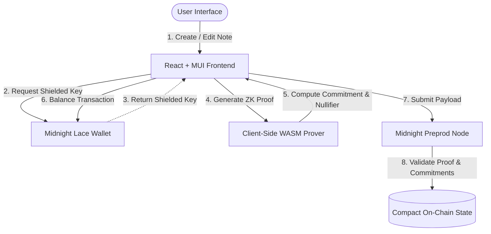

# Product Proposal: Secret Notes DApp on Midnight Network

## 1. Problem Statement

Traditional note-taking applications and cloud storage providers force a compromise between accessibility and privacy.

In centralized cloud services (e.g. Google Keep, Notion, Evernote), third-party providers store unencrypted or server-side encrypted note text in centralized databases. This creates single points of failure where server breaches, sub-poenas, insider threats, or automated data mining can expose sensitive personal notes, private keys, password drafts, or confidential research.

On transparent, public blockchains, data is globally visible. If a user stores note content or metadata on-chain, observers can easily correlate the user's wallet address with their private documents, exposing them to:
* **Targeted Retribution & Exploitation**: Financial details or sensitive drafts exposed on-chain can lead to targeted phishing or extortion.
* **Identity & Behavior Tracking**: Aggregated public records allow observers to profile user activities and private assets.

---

## 2. Proposed Solution

**Secret Notes DApp** solves the data privacy dilemma by combining zero-knowledge (ZK) cryptography with decentralized blockchain consensus on the **Midnight Network**.

Built on the **Midnight Network**, the application utilizes **Compact** smart contracts to run local ZK circuits directly inside the user's browser. This architecture completely isolates private note content from the public ledger:

1. **Local Private State**: Note titles, text content, and cryptographic salts are stored exclusively in local browser memory and encrypted local storage.
2. **Zero-Knowledge Circuit Execution**: The client browser computes ZK proofs verifying that note creation, modification, and deletion follow smart contract rules without exposing note plaintexts.
3. **On-Chain Commitment & Nullifier Ledger**: The Midnight ledger records only 32-byte cryptographic commitments (`sha256(title || content)`) and deterministic nullifiers (`hash("note:nullifier", id, sk)`). This guarantees:
   * **Absolute Note Confidentiality**: Note contents and titles are never transmitted or stored on-chain.
   * **Verifiable State Transitions**: Observers and node operators can verify that note operations are authentic and authorized without learning what the note contains.
   * **Double-Spending & Replay Prevention**: Deterministic nullifiers prevent unauthorized updates or replay attacks.

---

## 3. Target Users

The Secret Notes DApp is designed for users needing verifiable, private storage:
* **Web3 Professionals & Researchers**: Storing sensitive research notes, API keys, seed phrase backups, or strategic drafts securely.
* **Journalists & Whistleblowers**: Writing private logs and investigation notes without risking cloud database leaks.
* **DAOs & Executives**: Drafting confidential proposals or financial strategies prior to public disclosure.
* **Privacy-Conscious Everyday Users**: Maintaining a personal digital notebook secured by state-of-the-art ZK cryptography.

---

## 4. Core Features

* **Full Private CRUD Operations**: Create, Read, Update, and Delete notes seamlessly with client-side ZK proof generation.
* **Lace Wallet Integration**: Connect and disconnect the Midnight Lace Wallet for gas fee balancing and proof transaction submission on Preprod.
* **Observable Privacy Model**: Mathematical proof of note validity without revealing note plaintexts or user identities.
* **Persistent Local Private State**: Encrypted local storage cache linked to contract instance keys.
* **Contract Deployment & Joining**: Deploy custom notes contracts or join existing contract instances on Preprod.

---

## 5. Privacy Model: What an Observer Can and Cannot Learn

| Data Element | Observer Can Learn? | Explanation |
| :--- | :--- | :--- |
| **Note Title & Content** | ❌ **No** | Stored exclusively in local browser state; never sent across network or chain. |
| **User Secret Key (`sk`)** | ❌ **No** | Kept inside client private state provider. |
| **Note Commitment (`sha256`)** | ✅ **Yes** | 32-byte hash stored on-chain to verify note existence cryptographically. |
| **Note Nullifier** | ✅ **Yes** | 32-byte hash marked on-chain when a note is edited or deleted to prevent double-spending. |
| **Transaction Validity** | ✅ **Yes** | ZK proof verifies state rules were followed without revealing underlying note parameters. |

---

## 6. Technical Architecture

---

## 7. Submission Verification Assets

* **Public GitHub Repository**: [https://github.com/mystic8340-ai/lev3-Midnight](https://github.com/mystic8340-ai/lev3-Midnight)
* **Live Demo URL**: [https://lev3-midnight.vercel.app](https://lev3-midnight.vercel.app)
* **Preprod Contract Address**: `31ce882dfc68eaf553ffd7c601cecf36e386b49551c7309ed46458f9664f0de9`
* **Demo Video**: [Google Drive Walkthrough](https://drive.google.com/drive/folders/1VdZkEbYkubP3RYzzeJVh_Utx4k1CCuij?usp=sharing)
